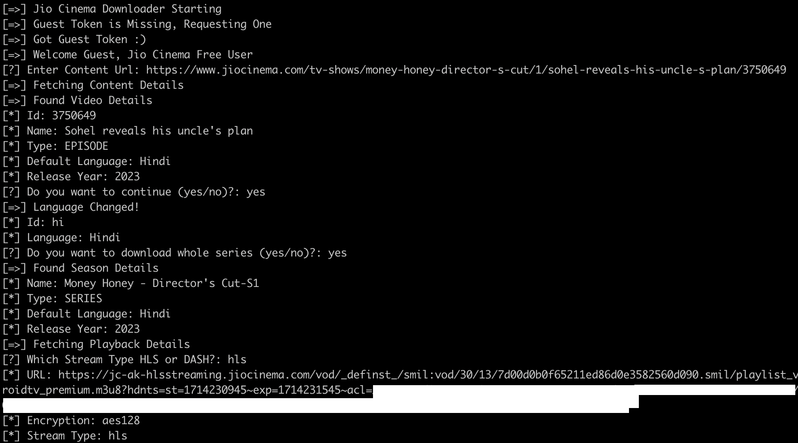

# JCineDown
 
- JCineDown is small python utility to download VOD content from the Jio Cinema streaming site. I utilize open source stuff to achieve this objective, By communicating with their server apis and simulating browser's flow.

- Widevine utility scripts uses device id blob from the old devices to allow server authorising keys for the streaming with Keys Caching to allow reusing keys without getting them again. A sample device's blob is provided in the project which is blocked by the server right now.

- Main Object of this project was to learn and understand the video streaming technologies and DRM's inner workings and downsides.

- To properly use this project, binaries of ffmpeg and mp4decrypt need to be place in `bin` directory with working device id blob for the widevine. It only supports guest token and so will only work with content which are watchable without any account.

## Demo Output:

## Credits
- [ffmpeg](https://ffmpeg.org/): Combining VOD Segments
- [yt-dlp](https://github.com/yt-dlp/yt-dlp): Downloading VOD Segments
- [pywidevine](https://github.com/devine-dl/pywidevine): Widevine Implementation
- [mp4decrypt](https://www.bento4.com/documentation/mp4decrypt/): Decryption of VOD Segments

### Notes
- This project is purely for the educational purpose
- Please don't use this project for pirating any content online
- This is NOT affiliated or approved by JioCinema/Jio/Viacom18